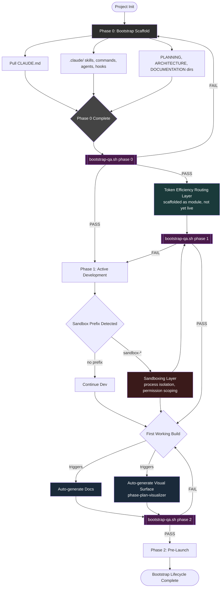

# Staged Bootstrap Architecture + QA Loop

## Mermaid Diagram



Edit/preview link: https://l.mermaid.ai/0PI51Q

---

## ASCII Diagram

```
STAGED BOOTSTRAP ARCHITECTURE (ASCII)

[ Project Init ]
        |
        v
+-----------------------------+
| PHASE 0: Bootstrap Scaffold |
|-----------------------------|
| - Pull CLAUDE.md            |
| - .claude/ (skills, cmds,   |
|   agents, hooks)            |
| - PLANNING / ARCHITECTURE / |
|   DOCUMENTATION dirs        |
+-----------------------------+
        |
        v
   < Phase 0 Complete >
              |
              v
   +-----------------------+
   | QA LOOP                |<---------------------+
   | bootstrap-qa.sh phase0 |                       |
   +-----------------------+                        |
        |            \                              |
     PASS           FAIL ------------ back to -------+ (Phase 0 Scaffold)
        |
        v
       /          \
      /            \
     v              v
+-----------+   +---------------------------+
| TOKEN     |   | PHASE 1:                  |
| ROUTING   |   | Active Development        |
| LAYER     |   +---------------------------+
| (scaffold |              |
|  only,    |              v
|  not live)|      < Sandbox Prefix? >
+-----------+        /            \
                  yes/              \no
                    v                v
          +------------------+   +----------------+
          | SANDBOXING LAYER |   | Continue Dev   |
          | (process         |   +----------------+
          |  isolation,      |         |
          |  permission      |         |
          |  scoping)        |         |
          +------------------+         |
                    \                 /
                     \               /
                      v             v
              +-----------------------+
              | QA LOOP                |<-------+
              | bootstrap-qa.sh phase1 |         |
              +-----------------------+          |
                  |            \                 |
               PASS           FAIL -- back to ---+ (Phase 1 Active Dev)
                  |
                  v
           < First Working Build? >
                          |
                          v
              +-----------------------+
              | AUTO-GENERATE:        |
              | - Docs                |
              | - Visual Surface      |
              |   (phase-plan-vis)    |
              +-----------------------+
                          |
                          v
              +-----------------------+
              | QA LOOP                |<-------+
              | bootstrap-qa.sh phase2 |         |
              +-----------------------+          |
                  |            \                 |
               PASS           FAIL -- back to ---+ (First Working Build)
                  |
                  v
              +-----------------------+
              | PHASE 2: Pre-Launch   |
              +-----------------------+
                          |
                          v
              [ Bootstrap Lifecycle   ]
              [       Complete        ]
```

---

## Usage

```bash
./scripts/qa/bootstrap-qa.sh <project_root> [phase]
# phase = 0 | 1 | 2 | all   (default: all)
```

Run this after any phase reports itself complete, before advancing to the
next phase. A FAIL routes back to the phase you were just in instead of
letting the bootstrap advance on an unverified self-report. Every run
writes a timestamped log to `scripts/qa/`.
