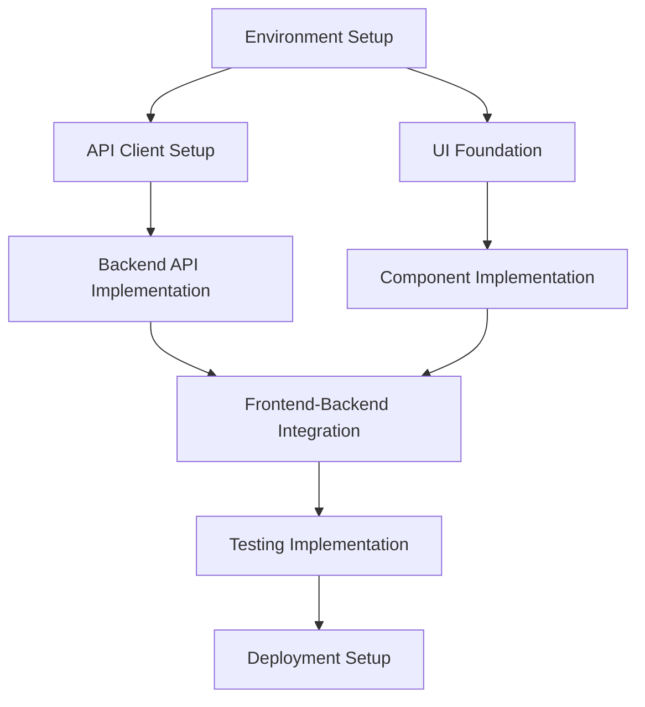

# Implement App Command

## Overview
Custom Claude Code command that orchestrates the implementation phase using design specifications from the design phase, with intelligent parallel execution.

## Command Syntax
```bash
claude --dangerously-skip-permissions implement app [design-folder] [target-app-folder] [options]
```

## Command Implementation

### Phase 1: Implementation Planning
```markdown
You are the PRIMARY ORCHESTRATOR for the implementation phase of application development.

INPUTS:
- Design folder: {design_folder_path}
- Target app folder: {target_app_folder}
- Manifest file: {design_folder_path}/manifest.json

STEP 1: VALIDATE DESIGN INPUTS
1. Verify manifest.json exists and phase is "design_complete"
2. Verify all required design output files exist:
   - ui-specifications.md
   - api-integrations.md
   - component-architecture.md
   - testing-strategy.md
   - security-requirements.md

STEP 2: ANALYZE TARGET APPLICATION
1. Check if target folder exists and has package.json
2. Identify framework (Next.js, React, Vue, etc.)
3. Analyze existing file structure
4. Determine integration strategy

STEP 3: CREATE IMPLEMENTATION PLAN
Based on design outputs, create dependency graph:



DEPENDENCY ANALYSIS COMPLETE. Proceed to Phase 2.
```

### Phase 2: Foundation Setup (Parallel)
```markdown
STEP 4: LAUNCH FOUNDATION SUBAGENTS

Execute the following subagents in PARALLEL (no interdependencies):

SUBAGENT 1: ENVIRONMENT-CONFIGURATOR
Input: api-integrations.md + target folder
Output: Environment variables, config files, API client setup
Template: /agents/implementation/environment-configurator.md

SUBAGENT 2: UI-FOUNDATION-BUILDER  
Input: ui-specifications.md + component-architecture.md + target folder
Output: Base UI components, styling system, layout components
Template: /agents/implementation/ui-foundation-builder.md

SUBAGENT 3: PROJECT-STRUCTURE-ORGANIZER
Input: All design specs + target folder
Output: Optimized folder structure, import/export setup
Template: /agents/implementation/project-structure-organizer.md

PARALLEL EXECUTION: All three foundation subagents can run simultaneously.
Wait for ALL foundation subagents to complete before proceeding to Phase 3.
```

### Phase 3: Core Implementation (Mixed Parallel/Sequential)
```markdown
STEP 5: LAUNCH CORE IMPLEMENTATION SUBAGENTS

GROUP A - PARALLEL EXECUTION (Dependencies: Foundation complete):

SUBAGENT 4: BACKEND-API-BUILDER
Dependencies: environment-configurator
Input: api-integrations.md + environment config
Output: API routes, data fetching logic, error handling
Template: /agents/implementation/backend-api-builder.md

SUBAGENT 5: COMPONENT-BUILDER
Dependencies: ui-foundation-builder + project-structure-organizer
Input: component-architecture.md + ui-specifications.md
Output: Feature components, forms, data displays
Template: /agents/implementation/component-builder.md

PARALLEL EXECUTION: Subagents 4 and 5 can run simultaneously.

Wait for BOTH to complete before proceeding to Group B.

GROUP B - SEQUENTIAL EXECUTION (Dependencies: Group A complete):

SUBAGENT 6: INTEGRATION-COORDINATOR
Dependencies: backend-api-builder + component-builder
Input: All previous outputs
Output: Connected frontend-backend functionality
Template: /agents/implementation/integration-coordinator.md

Wait for integration-coordinator to complete before proceeding to Phase 4.
```

### Phase 4: Quality and Deployment (Parallel)
```markdown
STEP 6: LAUNCH QUALITY ASSURANCE SUBAGENTS

Execute the following subagents in PARALLEL (Dependencies: Integration complete):

SUBAGENT 7: TESTING-IMPLEMENTER
Dependencies: integration-coordinator
Input: testing-strategy.md + all implementation code
Output: Unit tests, integration tests, e2e tests
Template: /agents/implementation/testing-implementer.md

SUBAGENT 8: PERFORMANCE-OPTIMIZER
Dependencies: integration-coordinator  
Input: All implementation code + ui-specifications.md
Output: Performance optimizations, bundle analysis, loading optimization
Template: /agents/implementation/performance-optimizer.md

SUBAGENT 9: SECURITY-HARDENER
Dependencies: integration-coordinator
Input: security-requirements.md + all implementation code
Output: Security implementations, validation, sanitization
Template: /agents/implementation/security-hardener.md

SUBAGENT 10: DEPLOYMENT-CONFIGURATOR
Dependencies: integration-coordinator
Input: All implementation code + project requirements
Output: Build scripts, deployment configs, CI/CD setup
Template: /agents/implementation/deployment-configurator.md

PARALLEL EXECUTION: All four quality subagents can run simultaneously.
Wait for ALL quality subagents to complete before proceeding to Phase 5.
```

### Phase 5: Final Validation and Documentation
```markdown
STEP 7: FINAL VALIDATION

FUNCTIONALITY VALIDATION:
1. [ ] Application builds without errors
2. [ ] All API integrations function correctly  
3. [ ] UI components render as designed
4. [ ] User flows work end-to-end
5. [ ] Error handling works properly
6. [ ] Tests pass (unit, integration, e2e)

STEP 8: GENERATE IMPLEMENTATION REPORT
Create implementation-report.md:

## Implementation Report
### Successfully Implemented Features
- [List all completed features with status]

### Known Issues and Required Manual Fixes
- [List any issues that need manual intervention]

### Next Steps for Production Readiness
- [List remaining tasks for production deployment]

### Testing Results
- [Summary of test coverage and results]

### Performance Metrics
- [Bundle size, load times, optimization results]

STEP 9: UPDATE PROJECT MANIFEST
Update manifest.json:
```json
{
  "phase": "implementation_complete",
  "implementation_completed_at": "{timestamp}",
  "target_folder": "{target_app_folder}",
  "validation_results": {
    "builds_successfully": true,
    "tests_passing": true,
    "api_integrations_working": true,
    "ui_functional": true,
    "ready_for_testing": true
  },
  "manual_interventions_needed": [
    "List any required manual fixes"
  ]
}
```

IMPLEMENTATION PHASE COMPLETE.
```

## Parallel Execution Strategy

### Dependency Management
```markdown
## Safe Parallel Execution Rules

✅ CAN RUN IN PARALLEL:
- Environment setup + UI foundation (no file conflicts)
- Backend API + Frontend components (separate folders)
- Testing + Performance optimization (read-only analysis)
- Security hardening + Deployment config (different concerns)

❌ MUST RUN SEQUENTIAL:
- Foundation → Core implementation (needs foundation files)
- API setup → Integration (needs API endpoints defined)
- Implementation → Quality assurance (needs complete code)

## File Coordination Strategy
Each subagent writes to specific, non-overlapping locations:
- environment-configurator: .env, config/, lib/api-clients/
- ui-foundation-builder: components/ui/, styles/, layouts/
- backend-api-builder: pages/api/, lib/services/, utils/api/
- component-builder: components/features/, hooks/, types/
- testing-implementer: __tests__/, test-utils/, cypress/
```

### Orchestrator Coordination
```markdown
## Coordination Mechanisms

1. **File Location Management**: Each subagent has designated output locations
2. **Dependency Checking**: Verify required files exist before launching dependent subagents
3. **Progress Monitoring**: Track completion status of each subagent
4. **Error Recovery**: Handle failures and coordinate retries
5. **Integration Validation**: Ensure subagent outputs work together
```

## Usage Examples

### Basic Implementation
```bash
claude --dangerously-skip-permissions implement app ./design-outputs/ ./my-app/
```

### With Specific Framework
```bash
claude --dangerously-skip-permissions implement app ./design-outputs/ ./my-next-app/ --framework next-js-15
```

### With Testing Focus
```bash
claude --dangerously-skip-permissions implement app ./design-outputs/ ./my-app/ --focus testing --test-framework jest
```

### With Performance Priority
```bash
claude --dangerously-skip-permissions implement app ./design-outputs/ ./my-app/ --optimize performance --bundle-analyzer
```

## Expected Outputs

After successful implementation:
```
target-app-folder/
├── package.json (updated with new dependencies)
├── .env.example (environment variable template)
├── src/
│   ├── components/
│   │   ├── ui/          # Foundation UI components
│   │   ├── features/    # Feature-specific components
│   │   └── layout/      # Layout components
│   ├── hooks/           # Custom React hooks
│   ├── lib/
│   │   ├── api-clients/ # API integration code
│   │   └── utils/       # Utility functions
│   ├── types/           # TypeScript type definitions
│   └── styles/          # Styling files
├── pages/ (or app/)     # Next.js pages or React Router routes
├── __tests__/           # Test files
├── cypress/             # E2E tests (if applicable)
└── deployment/          # Deployment configurations
```

## Common Manual Interventions

### Expected Issues (Plan for 1-2 additional prompts):
1. **API Wiring Issues**: Components rendering mock data instead of real API calls
2. **Route Configuration**: Missing or incorrect route setups
3. **Environment Variables**: API keys and secrets need manual configuration  
4. **CSS Conflicts**: Styling issues between different component libraries
5. **Type Errors**: TypeScript compilation issues
6. **Build Configuration**: Webpack/Vite configuration adjustments

### Recovery Strategies:
```markdown
## Issue Resolution Patterns

1. **API Integration Problems**:
   - Verify API client configuration
   - Check component-to-API wiring
   - Validate environment variables

2. **UI Rendering Issues**:
   - Check component import/export paths
   - Verify CSS/styling integration
   - Validate responsive design implementation

3. **Build/Deployment Issues**:
   - Review package.json dependencies
   - Check build script configuration
   - Validate deployment environment setup
```

## Performance Optimization Features

### Automatic Optimizations Applied:
- Code splitting at route level
- Component lazy loading for heavy features
- Image optimization for static assets
- Bundle analysis and size optimization
- Caching strategies for API calls
- Performance monitoring setup

### Manual Optimization Recommendations:
- Database query optimization (if applicable)
- CDN setup for static assets
- Advanced caching strategies
- Performance monitoring and alerting

This command is designed to work seamlessly with outputs from the `design app` command, ensuring a smooth transition from design to working application.
